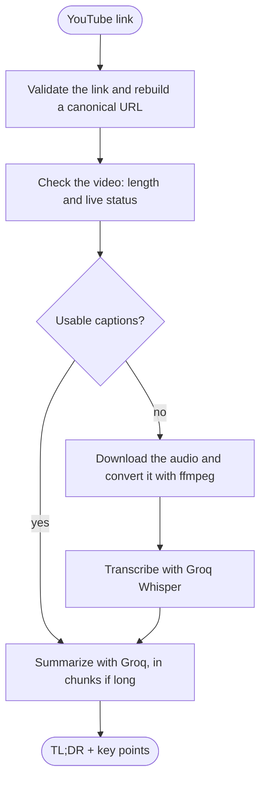
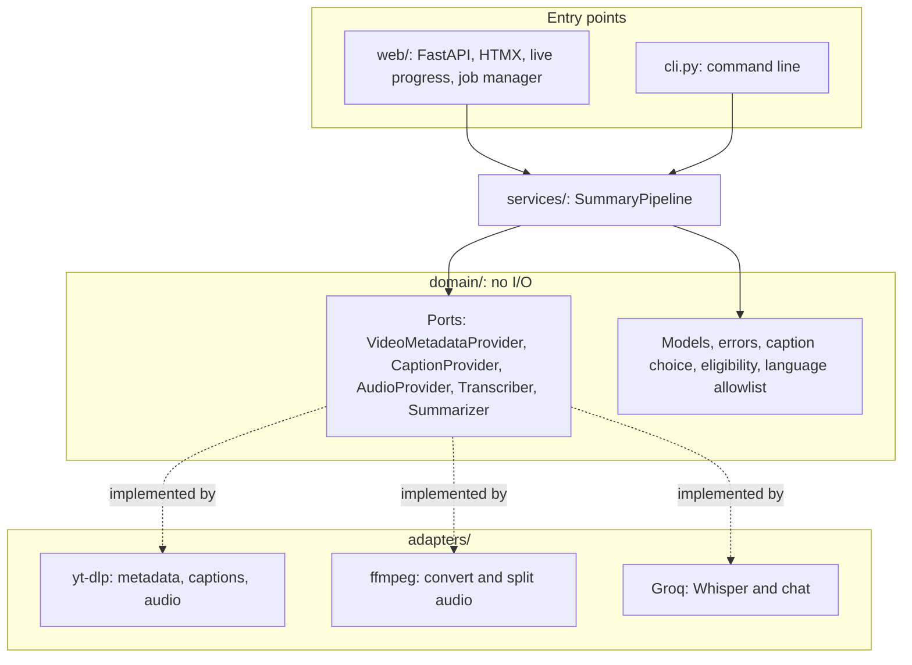

# vidbrief

[](https://github.com/mbarboss/vidbrief/actions/workflows/ci.yml)

> Paste a YouTube link and get a concise AI-generated summary in your language.

**Status:** feature-complete for local use (web app and command line).

## Features

- Paste a YouTube link (watch, short, Shorts, live or embed URL) and pick one of the
  supported summary languages.
- Uses the video's own captions when they exist and only falls back to downloading and
  transcribing the audio (Groq Whisper) when they do not.
- Summarizes into a TL;DR plus 3 to 10 key points with a Groq chat model, splitting long
  transcripts into chunks so every request fits the free tier's per-minute token limit.
- Shows live progress for each step (Server-Sent Events), with timings and request counters.
- Copies the summary as Markdown or downloads it as a `.md` file.
- Explains failures in plain words and offers "Try again" when waiting may help.
- Light and dark themes, works on phones and without JavaScript.
- A command-line mode that prints the summary as Markdown.
- Runs only on your machine, with hardened defaults (see [Security](#security)).

## How it works



### Which captions are used

When a video has captions, vidbrief picks one track in this order and only transcribes the
audio when none fits:

1. Captions written by the uploader in the spoken language.
2. YouTube's automatic speech recognition in the spoken language.
3. Captions written by the uploader in another language (English first).

Machine-translated automatic captions are never used; the summarizer translates from the
original text instead. Sound-only cues such as `[Music]` or `[Applause]` are dropped.
Captions longer than the video could plausibly hold (more than 40 characters per second)
are ignored and the audio is transcribed instead, so a crafted caption file cannot turn
one summary into thousands of billed requests.

### Audio fallback

Without usable captions, vidbrief downloads only the audio stream (never the video) and
converts it to 24 kbps mono Opus, which keeps speech clear for Whisper at about 10 MB per
hour. Recordings larger than `VIDBRIEF_AUDIO_CHUNK_MAX_MB` are split by time into chunks;
with the defaults (24 MB, videos up to 2 hours) the whole audio always fits in one
request, and splitting only kicks in if you lower the chunk size or raise the duration
limit.
All files live in a temporary folder that is deleted as soon as the job ends, even when
it fails.

### Transcription

The audio chunks are sent one at a time to Groq's Whisper model
(`VIDBRIEF_TRANSCRIPTION_MODEL`), with the video's spoken language as a hint when YouTube
reports it. The last words of each chunk are passed along with the next one so sentences
cut at a chunk boundary stay coherent.

Timeouts, connection errors and server errors are retried up to three times per chunk.
When Groq's rate limit asks for a wait of up to a minute, vidbrief waits and retries;
longer waits (for example, when the free tier's hourly audio quota is used up) end the job
with a "try again later" message instead of blocking it.

On Groq's free tier, speech-to-text is limited to 2 hours of audio per hour and 8 hours
per day, so only a few long videos without captions can be transcribed each day. Videos
with captions do not use this quota.

### Summary

The transcript is summarized by a Groq chat model (`VIDBRIEF_SUMMARY_MODEL`) into a TL;DR
and 3 to 10 key points, in the language you choose. The model must support strict
structured outputs (currently `openai/gpt-oss-120b`, `openai/gpt-oss-20b` and
`qwen/qwen3.8-27b` on Groq). The model may mark a few key terms in **bold** and code or
commands as `code`; any other Markdown it writes is shown as plain text. It is also asked
not to use em dashes.

Groq limits how many tokens each API key can use per minute, counting the prompt plus the
longest answer a request allows. vidbrief therefore sizes every request to that limit:

- A transcript that fits in one request is summarized directly.
- A longer one is cut into chunks (at sentence ends when possible); each chunk becomes
  short notes, and the notes are summarized. Notes that are still too long are condensed
  again first.
- The first request uses a size that fits the free tier. After that, vidbrief reads the
  limit Groq reports in every response and uses 75% of it (up to 32,000 tokens per request),
  so paid plans automatically get fewer, larger requests. To pin the size instead, set
  `VIDBRIEF_SUMMARY_MAX_REQUEST_TOKENS`.

Measured on the free tier: a 57-minute lecture with captions was summarized in 74 seconds
(six requests, including four short waits for the per-minute token limit), and a
13-minute talk without usable captions took 15 seconds end to end (download and
conversion 10 s, Whisper 3 s, summary 1 s). Expect roughly one to two minutes per hour of
captioned video; paid plans are faster.

## Supported links

Only video links on YouTube's own hosts are accepted; the `https://` prefix is optional and
extra parameters such as `t=`, `list=` or `si=` are ignored.

| Format | Example |
|---|---|
| Watch page | `https://www.youtube.com/watch?v=dQw4w9WgXcQ` |
| Short link | `https://youtu.be/dQw4w9WgXcQ` |
| Shorts | `https://www.youtube.com/shorts/dQw4w9WgXcQ` |
| Live | `https://www.youtube.com/live/dQw4w9WgXcQ` |
| Embed | `https://www.youtube.com/embed/dQw4w9WgXcQ` |

Accepted hosts: `youtube.com`, `www.youtube.com`, `m.youtube.com`, `youtu.be` and
`www.youtube-nocookie.com`. Playlists and channel pages are not supported.

### Videos that cannot be summarized

- Live streams that are in progress, scheduled or still being processed (finished streams
  work normally).
- Private, removed, region-blocked, age-restricted or members-only videos. vidbrief never
  uses your YouTube/Google login cookies, so restricted content stays out of reach by design.
- Videos longer than `VIDBRIEF_MAX_VIDEO_DURATION_SECONDS` (2 hours by default), or whose
  length YouTube does not report.

## Tech stack

| Layer | Technology |
|---|---|
| Language | Python 3.12, managed with [uv](https://docs.astral.sh/uv/) |
| Web | FastAPI, Jinja2, HTMX, Server-Sent Events |
| Media | yt-dlp (+ Deno JS runtime), ffmpeg |
| AI | Groq API (Whisper for speech-to-text, GPT-OSS for summarization) |
| Quality | Ruff, mypy (strict), pytest, pre-commit, poethepoet, GitHub Actions |
| Security | Ruff security rules (Bandit), detect-secrets, pip-audit |

## Architecture

The code follows a lightweight ports-and-adapters layout: the pipeline only talks to
interfaces declared in the domain, and the adapters behind them are the only code that
touches yt-dlp, ffmpeg or Groq. That keeps the core testable without network access and
makes a provider easy to swap.



| Package | Responsibility |
|---|---|
| `domain/` | Data models, errors with user-facing messages, ports (`Protocol`s) and pure rules. No I/O. |
| `services/` | The pipeline that orchestrates the ports, progress text and the Markdown report. |
| `adapters/` | yt-dlp, ffmpeg and Groq implementations of the ports. |
| `web/` | FastAPI app, routes, background jobs, live progress and security middleware. |
| `composition.py` | Wires the real adapters into the pipeline; the only place that knows all of them. |
| `config.py` | Validated, immutable settings read from the environment and `.env`. |

## Prerequisites

vidbrief runs on Linux, macOS and Windows; every change is tested on all three by CI
(Ubuntu, macOS and Windows with Python 3.12 and 3.14).

- [uv](https://docs.astral.sh/uv/getting-started/installation/) (installs Python for you)
- [ffmpeg](https://ffmpeg.org/) (audio conversion)
- [Deno](https://deno.com/) (required by yt-dlp for YouTube)
- A [Groq API key](https://console.groq.com/keys)

| System | Install the tools |
|---|---|
| Ubuntu / Debian | `sudo apt install ffmpeg`, then `curl -LsSf https://astral.sh/uv/install.sh \| sh` and `curl -fsSL https://deno.land/install.sh \| sh` |
| macOS ([Homebrew](https://brew.sh/)) | `brew install uv ffmpeg deno` |
| Windows (winget) | `winget install astral-sh.uv Gyan.FFmpeg DenoLand.Deno` |
| Windows ([Chocolatey](https://chocolatey.org/)) | `choco install ffmpeg deno`, plus uv with winget or its [installer](https://docs.astral.sh/uv/getting-started/installation/) |

Open a new terminal afterwards so the tools are on your `PATH`. vidbrief checks for
ffmpeg, ffprobe and Deno at startup and names whichever one is missing.

## Getting started

```bash
git clone https://github.com/mbarboss/vidbrief.git
cd vidbrief
uv run poe install
```

Then create your `.env` from the example and set `GROQ_API_KEY` in it:

```bash
cp .env.example .env && chmod 600 .env    # Linux and macOS
Copy-Item .env.example .env               # Windows (PowerShell)
```

### Web server

```bash
uv run vidbrief serve
```

Then open `http://127.0.0.1:8000` (or your `VIDBRIEF_HOST`:`VIDBRIEF_PORT`); Ctrl+C stops
the server. It checks for ffmpeg, ffprobe and Deno before starting and logs JSON at
`VIDBRIEF_LOG_LEVEL`.

Paste a link, pick the summary language and press Summarize. The job page shows live
progress (each step with its time, plus a counter for transcription and summary requests)
and then the TL;DR and key points, which can be copied as Markdown or downloaded as a
`.md` file (`/jobs/<id>/summary.md`). Its address works for an hour after the summary
finishes, so the tab can be closed and reopened; jobs live in memory and are lost when the
server stops. Only `VIDBRIEF_MAX_CONCURRENT_JOBS` summaries run at once and further requests
are refused until one finishes. The pages follow the system's light or dark theme (the
header button switches and remembers it), work on phones, and also work with JavaScript
disabled (the job page then refreshes itself every few seconds).

When a summary fails, the job page says what went wrong and, where possible, what to do
about it (for example checking `GROQ_API_KEY` when Groq refuses the key). Failures that may
pass, such as Groq being busy or a stream that has not ended yet, offer "Try again", which
reopens the form with the same link and language filled in.

### Command line

Videos can also be summarized from the terminal:

```bash
uv run vidbrief "https://youtu.be/jNQXAC9IVRw" --language pt-BR
uv run vidbrief "https://youtu.be/jNQXAC9IVRw" > summary.md   # save to a file
```

Progress is shown on stderr (for example `Transcribing (2/5)...` or
`Writing the summary (3/~9)...`, where `~` marks an estimate) and the summary is printed to stdout
as Markdown. `--language` accepts the allowlisted codes (default:
`VIDBRIEF_DEFAULT_SUMMARY_LANGUAGE`) and `--verbose` shows JSON logs at
`VIDBRIEF_LOG_LEVEL`. The exit status is 0 on success, 1 when the video cannot be
summarized, 2 for invalid arguments or configuration and 130 when cancelled with Ctrl+C.
Errors are printed as `Error: <what went wrong>`, followed by a line with what to do when
there is something to do.

## Configuration

All settings are read from environment variables or `.env`. See [`.env.example`](.env.example).

| Variable | Default | Description |
|---|---|---|
| `GROQ_API_KEY` | — (required) | Groq API key |
| `VIDBRIEF_TRANSCRIPTION_MODEL` | `whisper-large-v3-turbo` | Speech-to-text model |
| `VIDBRIEF_SUMMARY_MODEL` | `openai/gpt-oss-120b` | LLM used for summaries |
| `VIDBRIEF_DEFAULT_SUMMARY_LANGUAGE` | `pt-BR` | Default summary language (allowlisted) |
| `VIDBRIEF_MAX_VIDEO_DURATION_SECONDS` | `7200` | Longest video accepted |
| `VIDBRIEF_AUDIO_CHUNK_MAX_MB` | `24` | Max audio chunk size sent to Groq, in decimal MB |
| `VIDBRIEF_SUMMARY_MAX_REQUEST_TOKENS` | — (automatic) | Fixed token budget (prompt + answer) per summary request, 2000 to 131072; unset follows the limit Groq reports |
| `VIDBRIEF_REQUEST_TIMEOUT_SECONDS` | `120` | Timeout for external API calls |
| `VIDBRIEF_MAX_CONCURRENT_JOBS` | `1` | Summaries that can run at once in the web server, 1 to 4 |
| `VIDBRIEF_HOST` | `127.0.0.1` | Bind address (loopback only) |
| `VIDBRIEF_PORT` | `8000` | HTTP port |
| `VIDBRIEF_LOG_LEVEL` | `INFO` | Log verbosity |

## Third-party assets

Served from the package itself, never from a CDN, and kept byte-for-byte as published (the
HTMX hash is pinned in the tests and in the page's `integrity` attribute):

| Asset | Version | License |
|---|---|---|
| [HTMX](https://htmx.org/) | 2.0.11 | 0BSD |
| [htmx SSE extension](https://htmx.org/extensions/sse/) | 2.2.4 | 0BSD |
| [Bricolage Grotesque](https://github.com/ateliertriay/bricolage) (variable, Latin) | Fontsource 5.3.0 | SIL OFL 1.1 |
| [JetBrains Mono](https://github.com/JetBrains/JetBrainsMono) (variable, Latin) | Fontsource 5.3.0 | SIL OFL 1.1 |

## Development

Tasks are defined in `pyproject.toml` and run the same way on every system:

```bash
uv run poe            # list all tasks
uv run poe format     # auto-format and fix lint issues
uv run poe check      # lint + typecheck + tests + dependency audit
```

CI runs every pre-commit hook and the dependency audit, then the type checks and tests
(including the real-ffmpeg ones) on Ubuntu, macOS and Windows. Actions are pinned to
commit SHAs and Dependabot proposes weekly updates for them and for `uv.lock`.

Integration tests hit real services and are skipped by default: `uv run pytest -m integration`.
The Groq tests need `GROQ_API_KEY` in `.env`; they use about 20 seconds of the audio
quota and a few hundred chat tokens.

## Security

- Runs locally only: the server refuses to bind to non-loopback addresses.
- Secrets are loaded from `.env` (git-ignored) and never logged: logs are structured JSON
  on stderr, and Groq API keys are masked as `[REDACTED]` in messages, extra fields
  (including values nested in objects) and tracebacks.
- Only YouTube URLs are accepted (SSRF protection): links with credentials, custom ports, IP
  addresses or non-HTTP schemes are rejected, and downstream tools only ever receive a
  canonical URL rebuilt from the validated video ID.
- ffmpeg runs without a shell and may only open local files (`-protocol_whitelist file`), so
  a crafted media file cannot make it fetch URLs.
- Errors from Groq are reduced to fixed reason codes, so provider messages never reach the
  UI or the logs, and transcript text is never logged.
- Transcripts are treated as untrusted data in LLM prompts (prompt-injection mitigation):
  they are sent between delimiter tags (forged tags are removed) under rules that forbid
  following instructions found in them, the model has no tools, its answer must match a
  strict JSON schema, and the summary language comes only from the allowlist.
- The web server is hardened against attacks from other sites open in the same browser:
  - it only answers to loopback host names (`localhost`, `127.0.0.1` or the configured
    address), which stops DNS rebinding;
  - state-changing requests sent by another site are refused based on `Sec-Fetch-Site`
    (or `Origin` in browsers without it), and forms also need a CSRF token tied to an
    `HttpOnly`, `SameSite=Strict` cookie;
  - every response carries a strict Content Security Policy (no inline scripts, no
    `eval`, only local files plus YouTube thumbnails), `nosniff`, `no-referrer`,
    anti-framing headers and `Cache-Control: no-store`;
  - API docs are disabled, the `Server` header and access log are off and proxy headers are
    ignored.
  - job pages use unguessable IDs, and video titles are always escaped.
- LLM output is untrusted. Summaries are flattened to single lines and stripped of control
  and bidirectional characters, then parsed with a Markdown subset that only knows bold,
  italics and code: links, images, raw HTML and block structure stay literal text. The
  page renders that subset to HTML and passes it through `nh3`, which keeps only
  `strong`, `em` and `code` without attributes. The Markdown report escapes everything
  else (and the whole video title), so neither can inject links, HTML or terminal escape
  sequences.

## Legal notice

Downloading YouTube content may conflict with YouTube's Terms of Service. vidbrief is intended for personal and educational use; you are responsible for how you use it.

## License

[MIT](LICENSE) © mbarboss
